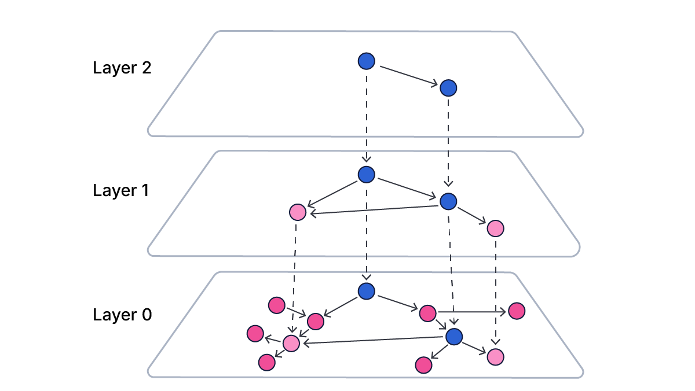

<h1 align="center">HNSWDB</h1>
<p align="center">
  <a href="https://www.elastic.co/search-labs/blog/hnsw-graph">
    
  </a>
</p>

<p align="center">
  <a href="https://pkg.go.dev/github.com/coder/hnsw@main?utm_source=godoc">
    
  </a>
</p>


Implementation of the Hierarchical Navigable Small World Data structure in GoLang. Inspired by the Hnswlib C++ header only library, with supplementation to my own AI/ML graduate degree education. This is repository is purely for educational purposes and is a work in progress. While it demonstrates the core concepts and algorithms, it is not optimized for production use.


## Overview

WIP


## References
- *Papers*
  - Yu A. Malkov and D. A. Yashunin. 2020. Efficient and Robust Approximate Nearest Neighbor Search Using Hierarchical Navigable Small World Graphs. IEEE Trans. Pattern Anal. Mach. Intell. 42, 4 (April 2020), 824–836. https://doi.org/10.1109/TPAMI.2018.2889473
- *Code Inspiration*
  - https://github.com/nmslib/hnswlib/tree/master
  - https://github.com/coder/hnsw/tree/main


## Notes and Design Choices 

### Search Algorithm  

#### Why Use Max Heap For Top Candidates
```
// Max-heap (by Dist)
type MaxHeapSearch []Candidate

func (h MaxHeapSearch) Len() int            { return len(h) }
func (h MaxHeapSearch) Less(i, j int) bool  { return h[i].Dist > h[j].Dist }
func (h MaxHeapSearch) Swap(i, j int)       { h[i], h[j] = h[j], h[i] }
func (h *MaxHeapSearch) Push(x interface{}) { *h = append(*h, x.(Candidate)) }
func (h *MaxHeapSearch) Pop() interface{} {
	old := *h
	n := len(old)
	x := old[n-1]
	*h = old[:n-1]
	return x
}
```
- Ensures worst result is always O(1) search away (i.e. first element in the Queue)
- We want to track and compare to the worst of the best during the algorithm. Consider a case when searching and the closest unexplored candidate is worse than our current worst element, we can stop searching. It provides a lower bound for how we do ANN.